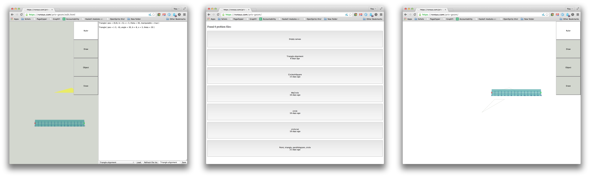
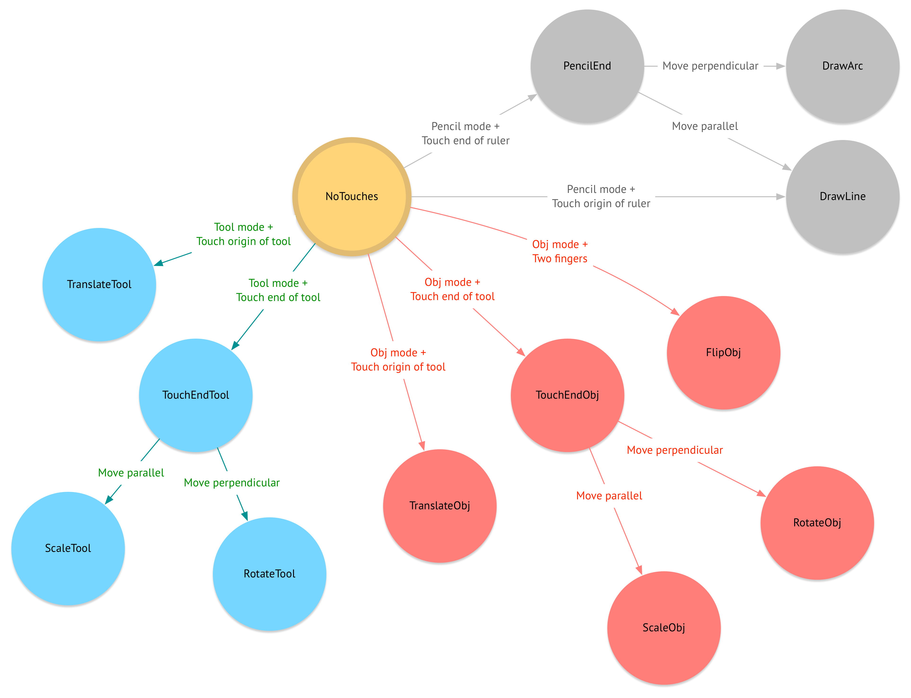

# Overview
This project ('Geom') is a Euclidean geometry workspace app, built under contract for Stanford professor Jay McClelland in summer 2014.

The goal of the project is to construct an environment in which a software agent can solve the geometry problems found on the New York State Regents test. The agent will be presented with a problem ("copy this triangle" plus a picture of the triangle), and it should have a virtual pencil, compass, and ruler in Geom to perform the task.

(A major difference between the Geom environment and [Ancient Greek Geometry](http://sciencevsmagic.net/geo/) or [Euclid: the Game](http://www.euclidthegame.com/) is that the user can use specific distances. A side can have a length of 5 units marked. That's why we have a *ruler* and not just a straightedge.)

At the moment, the app is usable by a human user in a Web browser (Chrome is the best-tested) on a PC or tablet. There may be some gestures which only work on a multitouch tablet (two fingers for flip, as of this writing). iPads and Android tablets can work, but performance is variable. The Surface Pro and other Windows tablets have the most consistent performance. Only human users can use the app right now, but we can compare their performance now to the agent's later on, and get an idea of the interaction-space for the agent.

I've written the software in the experimental Web programming language [Elm](http://elm-lang.org/). It's similar to Haskell or ML. It uses a functional reactive programming model for GUI construction. I'll try to be pretty concrete in this description, but things will make more sense if you're familiar with typed functional programming and/or FRP. If something isn't well-documented in the code, the type signatures should help.

Live version of the app is at [https://rsnous.com/priv-geom/](https://rsnous.com/priv-geom/) and [https://rsnous.com/priv-geom/edit.html](https://rsnous.com/priv-geom/edit.html).

# Architecture
I'll take this from the top down.

There are two Web entry points: edit.html and index.html (both in the root of the repository). Both use the same code for the actual app, but index.html has JavaScript code to load a problem from the server, and edit.html (meant to be used on a PC) has JS code to let the user author and save a problem while previewing it in the app.
With respect to the Elm app, the two files only differ in the size of the app's viewport and in the problem text sent to the app.

The window on the left is edit.html, the two windows on the right are the two stages of index.html (loading a problem and then using the app):

</img>

## The app itself
The 'main file' of the program is src/Geom.elm. The main object is Geom.main, as you might expect.

Geom.main multiplexes together several layers of the GUI to create the full app. The most important layer is the DrawState display layer, which we get from calling Geom.displayS.

Geom.displayS takes a stream of DrawStates from DrawState.drawStateS and uses DrawState.display to convert them into a rendered layer.

## DrawState
You should look at src/DrawState.elm next. The key type of the whole program is DrawState (types are actually defined in src/Types.elm to avoid circular imports; go there to get the definition of DrawState). DrawState has a bunch of fields which basically contain all the data that's in the app at a given time:

```haskell
type DrawState = { problem : ProblemDict

                 , lines : [Line]
                 , arcs : [Arc]
                 , points : [Point]

                 , tool : Context Tool

                 , displayWidth : Float
                 , displayHeight : Float
                 , mode : Mode

                 , gesture : Gesture
                 , drawing : Drawing }
```

- what stuff has the user drawn (`lines`, `arcs`, `points`))?
- what shapes came from the loaded problem, and what transformations have happened to those (`problem`)? 
- what transformations have happened to the ruler (`tool`)? 
- how big is the browser window, so we can scale the app canvas to that size (`displayWidth`, `displayHeight`)?
- what mode does the user have selected, so we know what gestures to trigger (`mode`)?
- what gesture is the user performing right now, if any? are they midway through drawing something that shouldn't be counted as a drawn shape just yet? (`gesture`, `drawing`)

If the heart of the computer stopped, and you wrote down everything in the DrawState, then rebooted the computer a year later and injected all that information back, you would be able to pick up *exactly* where you left off, even if you were halfway through drawing an arc or moving a shape.

`DrawState.display` renders that DrawState data to a GUI layer.

### Updates
The DrawState object inside the app gets updated whenever the user does anything interesting. See `drawStateS`: we `foldp` `DrawState.update` over `actions`, starting with `initialDrawState`. That means `update` gets called with whatever action the user did plus the current DrawState, and it spits out a new DrawState with the user's action applied.

There are a couple actions the user could do that would affect DrawState: they could edit the problem text, forcing a problem reload (`ChangeProblem`), they could change where they're touching on the screen (`Touches`, *this is the most important*), they could pick a new mode (`ChangeMode`), they could tap somewhere (`Tap`), they could resize the browser viewport (`Resize`).

## Problems
You can write, load, and save problems in edit.html's right pane. The left pane will automatically reparse and reevaluate the problem as you type.

Syntax is space-separated shape statements:

```
NameOfShape1 { pos = (3, 2), [optional: angle = {angle in degrees},
                                        manipulable = true | false,
                                        scalable = true | false],
               shapespecificparam1 = 10, shapespecificparam2 = 7... }

NameOfShape2 { pos = (10, -1), [optional: angle = {angle in degrees},
                                          manipulable = true | false,
                                          scalable = true | false],
               shapespecificparam1 = 10, shapespecificparam2 = 7... }
```

Here's one set of example shapes:

```
Point { pos = (0, 0), manipulable = true }

Triangle { pos = (5, 3), angle = 5, b = 6, s = 10, theta = 50, manipulable = true, scalable = true }

Parallelogram { pos = (5, -3), angle = 5, b = 6, s = 10, theta = 50 }

Circle { pos = (-3, -3), r = 2 }
```

Problems are fed from the JavaScript in edit.html or index.html (which takes them from the right pane or from the Parse server), through the `problemText` port into the app, which runs a parser (src/ProblemParser.elm) and eventually converts the problem text into a dictionary mapping integer indices to Context Object data.

So you have in the dictionary (which becomes the `problem` field of DrawState) a representation of [(0, a triangle at (0, 0) rotated 30 degrees with base length 3, side length 4, angle 30 degrees), (1, a circle at (10, 10) with radius 20), ...]. 

Problems which are manipulable are solid yellow. Problems which are scalable and manipulable are solid light blue. Problems which can't be manipulated at all have brown outlines.

## Gestures
OK, so we get a `Touches` action. How do we turn a list of the user's fingers on the screen into meaningful gestures?

Imagine a finite state machine. DrawState has a Gesture and Mode state in it, and we get some new `Touches`. We use the new `Touches` to transition between Gesture states depending on the current state and the touches.

For instance, if the user's not touching anywhere, and they're in Ruler mode, and then they put a finger down at the origin of the ruler, we transition into the TranslateTool state.

Types.Gesture is a data type whose constructors (NoTouches, TranslateTool, ...) are all the possible gesture states.

```haskell
data Gesture = NoTouches

             | TranslateTool { toolP0:Point, touchP0:Point, t:NTouch }
             | TouchEndTool { t:NTouch } -- before we've figured out which one
             | ScaleTool { l0:Length, t:NTouch }
             | RotateTool { angleOffset0:Angle, t:NTouch }

             -- ok is a key to find the object at issue in the Dict of objects
             | TranslateObj { ok:ObjectKey, oP0:Point, touchP0:Point, t:NTouch }
             | TouchEndObj { ok:ObjectKey, t:NTouch }
             | ScaleObj { ok:ObjectKey, l0:Length, t:NTouch }
             | RotateObj { ok:ObjectKey, angleOffset0:Angle, t:NTouch }
             | FlipObj { ok:ObjectKey }

             | PencilEnd { t:NTouch } -- before we've figured out which one
             | DrawLine { t:NTouch, p1:Point }
             | DrawArc { t:NTouch, c:Point, r:Length }
```

Transition rules are expressed in the `Gesture.gesture` function, which takes a list of normalized (coordinates shifted) touches and the current DrawState and returns the next Gesture state.

Here's a rough visualization of the gesture machine. The circles are Gesture states, colored by mode. The arrows are transitions which will occur when a Touches action happens (whenever the user moves their finger, takes a finger off, and/or puts a finger on).

I've left out two sets of arrows. Each state (except NoTouches) should have, in addition to the arrows in the diagram,

1. a transition arrow pointing to itself if exactly the same fingers that started the gesture are in the new set of touches ('continue this gesture, move a bit')
   - Exception: TouchEndTool, TouchEndObj, and PencilEnd will only transition back into themselves if the finger's movement is less than 5 pixels (natural jitter). If the finger's moved further, we can safely figure out whether the user is moving their finger perpendicular or parallel and transition appropriately.

2. a transition arrow pointing to NoTouches if the fingers have changed at all (finger's offscreen, new finger is touching the screen). This is how gestures end.

<a href="images/gestures.png"></img></a>

### Gesture actions
That's a description of the gesture states and transition rules between gestures, but how about the effects of the gestures on the world itself?

Look at `DrawState.touchesUpdate` for those rules. It runs `Gesture.gesture` and finds the new gesture state, then dispatches on that new gesture state to update the ruler, or the problem objects, or the drawing, depending on the mode and gesture.

# Potential tasks
## Maintenance and refactoring
These are some things which would be nice to have but aren't strictly necessary.

- Upgrade the code (import syntax, operators) to work in Elm 0.13
- Consider WebGL or elm-html for rendering instead of Graphics.Collage and Elements; this could greatly speed up performance, especially on mobile devices
- General profiling and optimization
- Right now, we have (in DrawState.touchesUpdate and Gesture.gesture) giant case expressions for gestures. It's manageable, *but* the gesture logic for the three primary modes (Object, Ruler, Draw) is almost exactly the same; 3x code duplication. We should abstract out the common logic and make a Mode record type that's like an interface, which each mode fills with any specific behavior and transition logic for the gestures.
- We have similar logic for manipulating Ruler/Tool and for manipulating problem Objects (both have spines and green/red points), and in fact both are wrapped in Context to store their positions and rotations. We should see if there's a way to unify those two things even further to avoid that code duplication.

## Further directions
- Instrument the app so a software agent can perform the same actions as a human. You can probably use Elm's WebSockets for this. I'm not sure what level of abstraction the agent will be working at (for both input and output), or how real-time the actions will need to be.
- Add support for 'patty paper' to draw on
- Add a protractor / angle measurement tools
- Correctness checking for problems
- Point labeling and text support for problems (right now you can only provide shapes)
- Move the problem hosting to a dedicated Stanford server with our own server software (we're using Parse to host problems currently)
- Drawing rays
